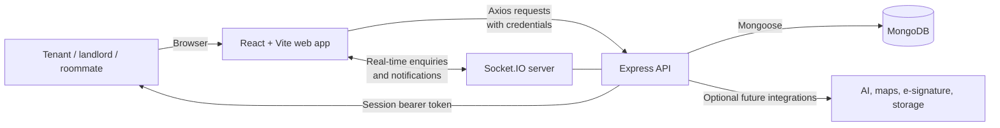
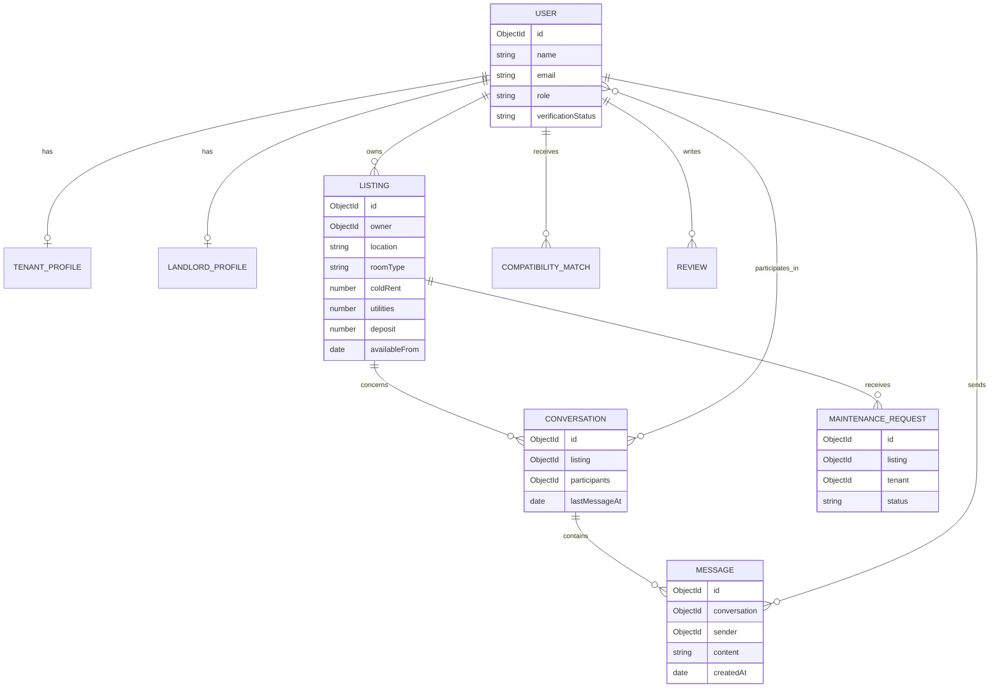

# LivSync — PropTech Rental & Roommate Platform

LivSync is a proposed PropTech web platform that makes renting a room or property safer, clearer, and more compatible for tenants, roommates, and landlords. It combines transparent listings, roommate matching, and direct communication in one place.

The product draws inspiration from platforms such as ImmoScout24 and WG-Gesucht (Germany), Zillow (US), SpareRoom and Rightmove (UK), and HousingAnywhere (Netherlands).

> **Project status:** The repository currently contains the Express/MongoDB foundation and a Vite + React + Tailwind frontend shell. The feature set below is the target product scope; listing, profile, messaging, matching, and trust modules have not yet been implemented.

## Problem statement

Finding a suitable rental home, room, or roommate is difficult because key information is scattered, incomplete, or unreliable. Renters often face:

- Listings with unclear rent, deposit, utility, brokerage, or hidden charges
- Fake or unverified listings and uncertainty about whom to trust
- A poor way to assess lifestyle compatibility before sharing accommodation
- Slow, fragmented communication between tenants, landlords, and roommates
- Paper-heavy rental and maintenance processes after moving in

Landlords face similar friction in identifying credible tenants, responding to enquiries, and managing requests after a property is occupied. LivSync addresses both sides of the rental journey with transparent information, trust signals, and a shared digital workflow.

## Proposed solution

LivSync will be a responsive web application where users can discover housing, compare full rental costs, evaluate roommate compatibility, and contact the relevant people directly.

The initial MVP concentrates on the highest-value path: search for a listing, inspect its complete details, create a tenant or landlord profile, find compatible roommates, and start an in-app enquiry. Trust, contract, AI, and lifecycle tools expand the platform after that core flow is working.

## Features

### Priority 1 — Core MVP

| Feature | Description |
| --- | --- |
| Listing search and filters | Search by location, budget, room type, and move-in date. |
| Property/room listing page | Show photos, floor plan, amenities, and a rent breakdown: cold rent, utilities, and total monthly rent. |
| Tenant and landlord profiles | Present the information needed to assess a prospective tenant, roommate, or property owner. |
| Roommate matching | Collect lifestyle, cleanliness, habits, and schedule preferences through a questionnaire and generate a compatibility score. |
| Contact and enquiry system | Enable private in-app messaging between tenants, landlords, and prospective roommates. |

### Priority 2 — Trust and transparency

| Feature | Description |
| --- | --- |
| Verified listing badge | Mark listings that have passed a verification process and give users a way to report suspicious content. |
| Digital rental agreement generator | Create simplified agreement templates and support an e-signature workflow. |
| Transparent fee disclosure | Show deposit, brokerage, utilities, and other charges before a user enquires. |
| Tenant and landlord ratings | Let eligible users leave accountable, post-interaction reviews. |

### Priority 3 — Differentiators

| Feature | Description |
| --- | --- |
| AI rent estimator | Provide a fair-price estimate using listing location, property attributes, and comparable listings. |
| Maintenance tracker | Let tenants raise issues and follow the request through assigned, in-progress, and resolved states. |
| AI chatbot assistant | Answer common questions about deposits, agreements, notice periods, and platform flows. |
| Virtual tours | Support a 360° photo or mock virtual-tour experience on listings. |

### Priority 4 — Stretch goals

| Feature | Description |
| --- | --- |
| Map-based search | Explore listings by map and estimate commute time to a university or workplace. |
| Document vault | Securely retain identity, income, and credit-verification documents with controlled sharing. |
| Listing alerts | Notify users when a new listing matches a saved search. |

## Technology stack

| Layer | Technology |
| --- | --- |
| Frontend | React, Vite, Tailwind CSS |
| Client utilities | Axios, React Router, Framer Motion, Lucide React |
| Backend | Node.js, Express.js |
| Database | MongoDB with Mongoose |
| Authentication | Server-side sessions, bcrypt, bearer tokens |
| Real-time messaging | Socket.IO |
| Input validation | express-validator |
| Development tooling | Nodemon, ESLint |

## System architecture



1. The React client provides search, listing, profile, matching, and dashboard experiences.
2. Express exposes validated APIs, enforces role and ownership checks, and returns a consistent response shape.
3. MongoDB stores user, listing, enquiry, matching, review, and maintenance data.
4. Socket.IO delivers new-message and notification events to authorised users in real time.
5. External services remain optional integrations for AI estimation, route/commute data, signatures, and secure document storage.

## API design

Every API response should use this structure:

```json
{
  "success": true,
  "message": "Descriptive result message",
  "data": {}
}
```

### Current endpoint

| Method | Endpoint | Description | Authentication |
| --- | --- | --- | --- |
| `GET` | `/` | Confirms that the backend server is responding. | No |

### Planned MVP endpoints

| Method | Endpoint | Description | Authentication |
| --- | --- | --- | --- |
| `POST` | `/auth/register` | Register a tenant or landlord account. | No |
| `POST` | `/auth/login` | Authenticate and return a session token. | No |
| `POST` | `/auth/logout` | End the current session. | Yes |
| `GET` | `/auth/me` | Get the signed-in user and profile summary. | Yes |
| `GET` | `/listings` | Search and filter listings. | No |
| `POST` | `/listings` | Create a property or room listing. | Landlord |
| `GET` | `/listings/:listingId` | Get full listing details and rent breakdown. | No |
| `PATCH` | `/listings/:listingId` | Edit an owned listing. | Listing owner |
| `POST` | `/listings/:listingId/enquiries` | Start an enquiry with the listing owner. | Tenant |
| `GET` | `/conversations` | List the signed-in user’s conversations. | Yes |
| `GET` | `/conversations/:conversationId/messages` | Read messages in an authorised conversation. | Conversation member |
| `POST` | `/conversations/:conversationId/messages` | Send an in-app message. | Conversation member |
| `PATCH` | `/profiles/me` | Update the current tenant or landlord profile. | Yes |
| `POST` | `/matches/compatibility` | Calculate a roommate compatibility result from questionnaire responses. | Yes |

### Planned trust and lifecycle endpoints

| Method | Endpoint | Description | Authentication |
| --- | --- | --- | --- |
| `POST` | `/listings/:listingId/report` | Report a suspected fake or misleading listing. | Yes |
| `POST` | `/listings/:listingId/verification` | Submit listing-verification evidence. | Listing owner |
| `POST` | `/agreements` | Generate a rental agreement from approved template data. | Tenant / landlord |
| `POST` | `/reviews` | Submit an eligible tenant or landlord review. | Verified participant |
| `GET` | `/rent-estimate` | Request a fair-rent estimate for property details. | Yes |
| `GET` | `/maintenance` | Read maintenance requests for an authorised tenancy. | Tenant / landlord |
| `POST` | `/maintenance` | Raise a maintenance request. | Tenant |
| `PATCH` | `/maintenance/:requestId` | Update maintenance status or assignment. | Landlord / provider |
| `POST` | `/saved-searches` | Save a listing search and alert preferences. | Yes |

## Real-time events

Socket.IO is installed but is not wired into the current server. The proposed event contract is:

| Client event | Server event | Purpose |
| --- | --- | --- |
| `conversation:join` | `conversation:joined` | Join an authorised conversation channel. |
| `message:send` | `message:received` | Deliver a new enquiry or conversation message. |
| `maintenance:subscribe` | `maintenance:updated` | Receive updates to a tracked request. |
| `notification:subscribe` | `notification:received` | Receive listing, verification, and saved-search alerts. |

## Database design

The current MongoDB connection is configured in `backend/db/db.js` through the `DB_CONNECT` environment variable. No Mongoose models are present yet. The following is the proposed data model.

| Collection | Key fields | Purpose |
| --- | --- | --- |
| `users` | `name`, `email`, `phone`, `passwordHash`, `role`, `verificationStatus` | Credentials, roles, and account trust state. |
| `tenantProfiles` | `user`, `bio`, `occupation`, `moveInDate`, `budget`, `preferences` | Tenant details and roommate questionnaire answers. |
| `landlordProfiles` | `user`, `companyName`, `bio`, `verificationStatus` | Landlord identity and profile information. |
| `listings` | `owner`, `location`, `roomType`, `rent`, `utilities`, `deposit`, `photos`, `availability` | Searchable room and property inventory with transparent fees. |
| `conversations` | `participants`, `listing`, `lastMessageAt` | Enquiry and direct-message channels. |
| `messages` | `conversation`, `sender`, `content`, `readAt` | Messages within an authorised conversation. |
| `compatibilityMatches` | `user`, `candidate`, `score`, `breakdown` | Roommate-match results and score explanations. |
| `reviews` | `author`, `subject`, `listing`, `rating`, `comment` | Eligible tenant and landlord feedback. |
| `maintenanceRequests` | `listing`, `tenant`, `title`, `status`, `assignee` | Repair and maintenance workflow. |
| `savedSearches` | `user`, `filters`, `alertsEnabled` | Saved criteria used for listing alerts. |



## Security and privacy principles

- Store passwords only as bcrypt hashes; never return password fields in an API response.
- Store only a hash of each session token, expire sessions server-side, and protect restricted routes with authentication and role middleware.
- Restrict listing edits, conversations, documents, reviews, and maintenance requests to authorised owners or participants.
- Validate and sanitise all request data; rate-limit sensitive authentication and message routes when they are introduced.
- Keep uploaded documents private, encrypted where possible, and accessible only through time-limited, authorised URLs.
- Display verification as a trust signal, not a guarantee, and offer a reporting route for suspicious listings.

## Target project structure

```text
LivSync/
├── backend/
│   ├── app.js                 # Express application entry point
│   ├── db/
│   │   └── db.js              # MongoDB connection only
│   ├── controllers/           # Auth, listing, profile, message, matching handlers
│   ├── middlewares/           # Auth, role, validation, and error middleware
│   ├── models/                # Mongoose models
│   └── routes/                # Feature API routes
└── frontend/
    ├── src/
    │   ├── App.jsx            # React routing root
    │   ├── components/        # Reusable interface components
    │   └── pages/             # Public, tenant, landlord, and admin pages
    └── vite.config.js
```

The `controllers`, `middlewares`, `models`, `routes`, `components`, and `pages` directories shown above are the intended structure and will be created as their corresponding modules are implemented.

## Prerequisites

- Node.js 18 or newer
- npm 9 or newer
- A MongoDB database (local MongoDB or MongoDB Atlas)

## Environment variables

Create `backend/.env` with the following values:

```env
PORT=4000
DB_CONNECT=mongodb://127.0.0.1:27017/livsync
CLIENT_URL=http://localhost:5173
```

`PORT` and `DB_CONNECT` are used by the current backend, and `CLIENT_URL` is the origin CORS allows.
Sessions need no secret: logging in stores a random token in the `sessions` collection and the
browser sends it back in an `Authorization: Bearer` header.

Never commit real credentials. Commit an `.env.example` file containing placeholders instead.

## Setup instructions

1. Clone the repository and enter it:

   ```bash
   git clone https://github.com/coder-phoder/LivSync.git
   cd LivSync
   ```

2. Install backend dependencies:

   ```bash
   cd backend
   npm install
   ```

3. Create `backend/.env` using the variables above. Start MongoDB locally or use a MongoDB Atlas connection string for `DB_CONNECT`.

4. In a second terminal, install frontend dependencies:

   ```bash
   cd frontend
   npm install
   ```

## How to run the project

Start the backend from the `backend` directory:

```bash
npm run dev
```

The backend listens on [http://localhost:4000](http://localhost:4000). Confirm the current server is running with:

```bash
curl http://localhost:4000/
```

In another terminal, start the frontend from the `frontend` directory:

```bash
npm run dev
```

Vite prints the local frontend URL, normally [http://localhost:5173](http://localhost:5173). At the current stage, the frontend is a starter shell; the PropTech pages are part of the implementation roadmap.

## Available scripts

| Directory | Command | Description |
| --- | --- | --- |
| `backend` | `npm start` | Start the Express server with Node.js. |
| `backend` | `npm run dev` | Start the Express server with Nodemon. |
| `frontend` | `npm run dev` | Run the Vite development server. |
| `frontend` | `npm run build` | Create a production frontend build. |
| `frontend` | `npm run lint` | Run ESLint against the frontend. |
| `frontend` | `npm run preview` | Preview the production frontend build locally. |

## Implementation roadmap

1. Build authentication, tenant/landlord profiles, and role-aware middleware.
2. Add listing models and APIs with search, filters, photo metadata, and transparent rent calculations.
3. Implement the listing details, profile, enquiry, and messaging interfaces.
4. Build the roommate questionnaire and explainable compatibility-score logic.
5. Add verification/reporting flows, agreement templates, fee disclosures, and reviews.
6. Integrate Socket.IO notifications, maintenance tracking, AI estimation/chat assistance, and stretch features.

## License

No license has been declared for this repository yet. Add one before distributing the project or accepting external contributions.
